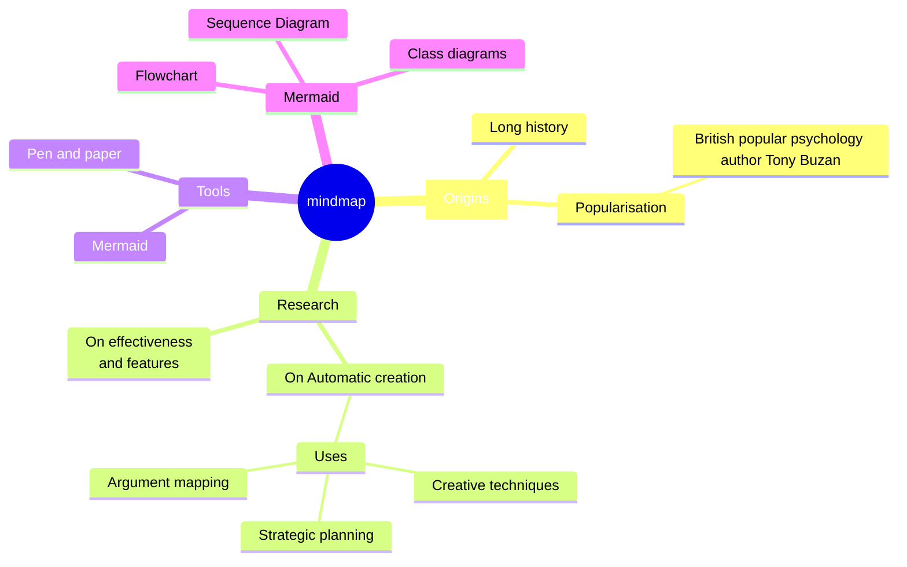

```mermaid

%%{
  init: {
    'theme': 'base',
    'themeVariables': {
    'text_color': '#fff',
      'primaryTextColor': '#fff',
    }
  }
}%%
mindmap
  root((mindmap))
    A[<font color = 'white'>Origins</font>]
      Long history
      ::icon(fa fa-book)
      Popularisation
        British popular psychology author Tony Buzan
    Research
      On effectiveness<br/>and features
      On Automatic creation
        Uses
            Creative techniques
            Strategic planning
            Argument mapping
    Tools
      Pen and paper
      Mermaid
    Mermaid
      Flowchart
      Sequence Diagram
      Class diagrams
      

```
